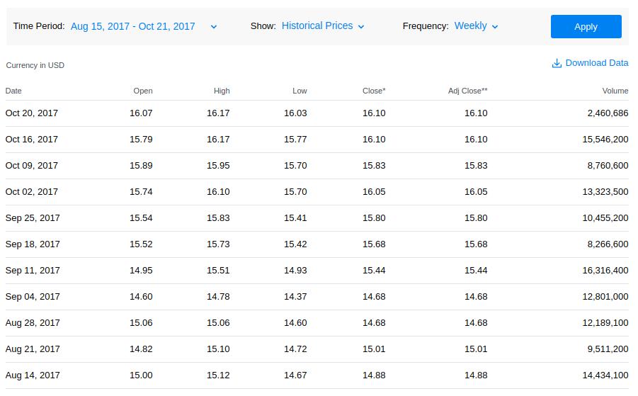
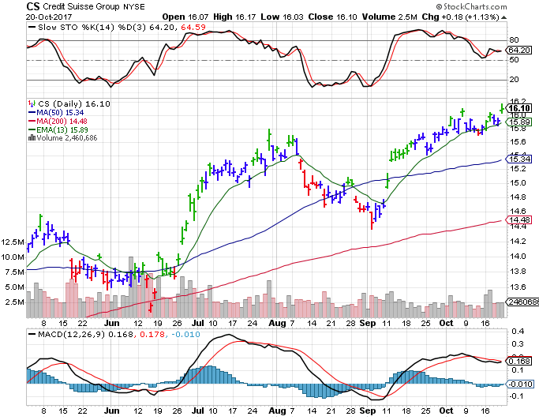
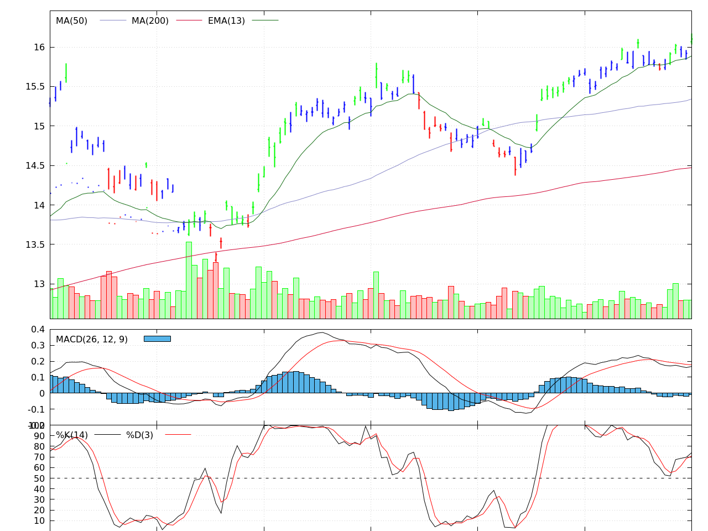

# Credit Suisse Group AG (ADR) [NYSE:CS] stock analysis.
One of the applications for streaming data processing is a time series analysis, for example stock technical indicators calculation. As an example we would consider Credit Suisse (NYSE:CS) daily stock data from [Yahoo Finance](https://finance.yahoo.com/quote/CS/history?period1=800553600&period2=1508515200&interval=1d&filter=history&frequency=1d): `CS.csv`

#### Step 1: Convert file to tab-separated format
```bash
cat <(echo '# Date,Open,High,Low,Close,Volume') <(tail -n+2 CS.csv | cut -d, -f1,2,3,4,6,7) | tr ',' '\t' > cs.tsv
```

#### Step 2: Calculate weekly data based on daily
:::info
This operation requires **strftime** and **mktime** functions which do not exist in mawk. Use GNU awk (gawk) for this operation.
:::

```bash
cat cs.tsv | tgrp \
        -k "Week=strftime(\"%U\", DateEpoch(Date))" \
        -g "Date=FIRST(Date)" \
        -g"Open=FIRST(Open)" \
        -g "High=MAX(High)" \
        -g "Low=MIN(Low)" \
        -g "Close=LAST(Close)" \
        -g "Volume=SUM(Volume)" \
    | ttail \
    | tsrt -k Date:desc \
    | tpretty

 Week | Date       | Open      | High      | Low       | Close     | Volume
------+------------+-----------+-----------+-----------+-----------+----------
 42   | 2017-10-16 | 15.790000 | 16.170000 | 15.770000 | 16.100000 | 15546200
 41   | 2017-10-09 | 15.890000 | 15.950000 | 15.700000 | 15.830000 | 8760600
 40   | 2017-10-02 | 15.740000 | 16.100000 | 15.700000 | 16.049999 | 13323500
 39   | 2017-09-25 | 15.540000 | 15.830000 | 15.410000 | 15.800000 | 10455200
 38   | 2017-09-18 | 15.520000 | 15.730000 | 15.420000 | 15.680000 | 8266600
 37   | 2017-09-11 | 14.950000 | 15.510000 | 14.930000 | 15.440000 | 16316400
 36   | 2017-09-05 | 14.600000 | 14.780000 | 14.370000 | 14.680000 | 12801000
 35   | 2017-08-28 | 15.060000 | 15.060000 | 14.600000 | 14.680000 | 12189100
 34   | 2017-08-21 | 14.820000 | 15.100000 | 14.720000 | 15.010000 | 9511200
 33   | 2017-08-14 | 15.000000 | 15.120000 | 14.670000 | 14.880000 | 14434100
```

[Expected result](https://finance.yahoo.com/quote/CS/history?period1=1502726400&period2=1508515199&interval=1wk&filter=history&frequency=1wk) from Yahoo Finance:


#### Step 3: Running metrics calculation
```bash
bash scripts/2-calculate-metrics.sh cs.tsv > metrics.tsv
```

Metrics include:
1. Moving Average for windown size 200 and 50.
2. Exponential moving average for window size 26 and 13.
3. [MACD(26, 12, 9)](https://en.wikipedia.org/wiki/MACD) histogram.
4. [Moving maximum](https://www.quora.com/How-can-I-solve-this-array-moving-window-max-problem-in-linear-time) and minimum for window size 14.
5. [Fast](https://www.fidelity.com/learning-center/trading-investing/technical-analysis/technical-indicator-guide/fast-stochastic) and [Slow](https://www.fidelity.com/learning-center/trading-investing/technical-analysis/technical-indicator-guide/slow-stochastic) Stochastics.

#### Step 4: Plot data
All of the computed metrics would worth nothing without visual representation. To keep our focus within command-line, one need to choose an appropriate plotting tool - [Gnuplot](http://www.gnuplot.info/)! This example uses version `5.2.0`.

Gnuplot script could not use a streaming file (aka stdin) twice, so `tplot` saves the stream to a temporary file and executes provided script with it. It allows use of `__input` and variables withing the file. For example:

```gnuplot
# instead of
using 0:2:3:4:5

# one can write
using 0:__Open:__High:__Low:__Close
```

In this example we plot Elder Impulse System OHLC markers, Simple moving averages MA(50) and MA(200), Exponential moving average EMA(13), MACD(26, 12, 9) histogram and Slow Stochastic(14, 3). All in under 60 lines on code.

To validate the result, check out [StockCharts](http://stockcharts.com/h-sc/ui) website, NYSE:CS dataset. Use parameters defined above. To match time period with StockCharts we use hardcoded 121 days of metrics. Note, that metrics have been calculated on the whole dataset.

```bash
cat metrics.tsv | ttail -n121 | tplot -c scripts/plot.gnu > metrics.png
```
Expected:

Result is not as fancy but it reveals the same insights:

